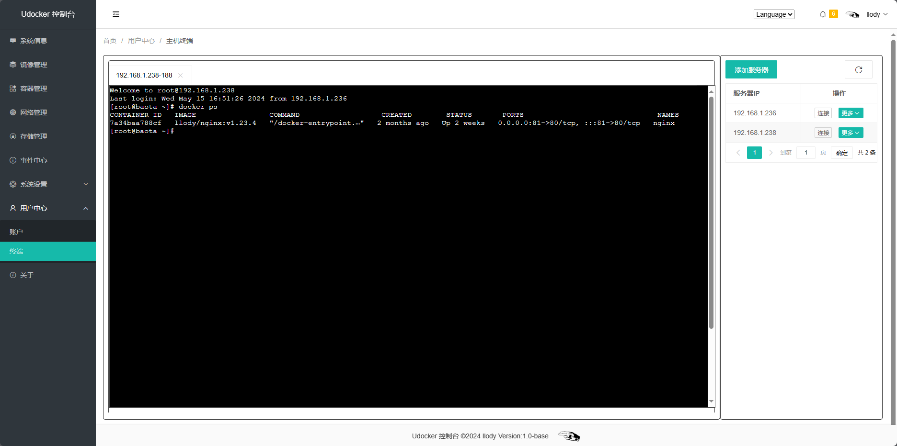
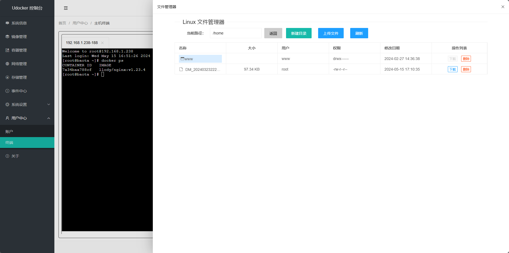
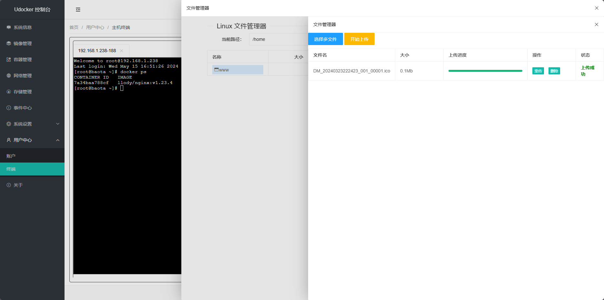

# udocker
<p align="center"><a href="#"></a></p>

**一个更简洁的Docker面板**

<div align="center">
<a href="https://github.com/llody55/udocker" target="_blank"></a>


</div>

> **声明:** 此项目当前为base版，请勿暴露于公网环境，可能引发安全问题
**如果此项目对你有用，请给一个**:star:

## 资源
> 只需要：1核1G即可，暂时只有X86版本

## 快速了解
> udocker 是一个轻量级且好用的docker管理面板，并且自带一个webssh终端管理工具,可以很方便的管理服务器和上传下载文件。

目前支持的功能有：

   - 镜像管理
   - 容器管理
   - 网络管理
   - 存储管理
   - 事件中心
   - 多语言(中英切换)
   - webssh终端
   - Linux文件管理器

## 安装与部署(推荐)
```
docker run -itd --name udocker -p 8000:8000 -p 9002:9002 -v /var/run/docker.sock:/var/run/docker.sock  llody/udocker:v1.1-base
```
> 默认账户：llody 密码：1qaz2wsx
## 预览







## HTTPS代理示例
### 七层反向代理
```nginx
server {
    listen      443 ssl;
    server_name udocker.llody.top;
    client_max_body_size 1000m;
    ssl_certificate /etc/nginx/llody.top/udocker.pem;
    ssl_certificate_key /etc/nginx/llody.top/udocker.key;
    ssl_session_timeout 5m;
    ssl_protocols TLSv1.2 TLSv1.3;
    ssl_ciphers ECDHE-RSA-AES128-GCM-SHA256:HIGH:!aNULL:!MD5:!RC4:!DHE;
    ssl_prefer_server_ciphers on;
    

    location / {
        proxy_pass http://192.168.1.236:9002/;
        proxy_set_header Host $http_host;
        proxy_set_header  X-Real-IP    $remote_addr;
        proxy_set_header  X-Forwarded-For $proxy_add_x_forwarded_for;
    }
    location /apps/webssh_terminal/ {
        proxy_pass http://192.168.1.236:9002;
        proxy_http_version 1.1;
        proxy_set_header Upgrade $http_upgrade;
        proxy_set_header Connection "upgrade";
        proxy_set_header Host $host;
        proxy_set_header X-Real-IP $remote_addr;
        proxy_set_header X-Forwarded-For $proxy_add_x_forwarded_for;
    }
    location /apps/docker_logs/ {
        proxy_pass http://192.168.1.236:9002;
        proxy_http_version 1.1;
        proxy_set_header Upgrade $http_upgrade;
        proxy_set_header Connection "upgrade";
        proxy_set_header Host $host;
        proxy_set_header X-Real-IP $remote_addr;
        proxy_set_header X-Forwarded-For $proxy_add_x_forwarded_for;
    }

  location /healthz {
    return 200;
  }
}
```
> 主要用于udocker面板的wss和https代理
### 四层反向代理
```nginx
server {
  listen 8000;
  proxy_pass 192.168.1.236:8000;
}
```
> 此代理主要是docker容器终端接口，存在**风险** ，暂时只实现连接，非必要可不做代理。

## 问题反馈
 - Issues

## Star趋势
[](https://github.com/llody55/udocker)