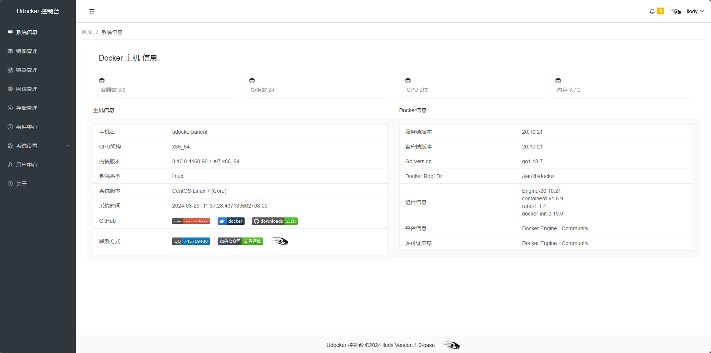
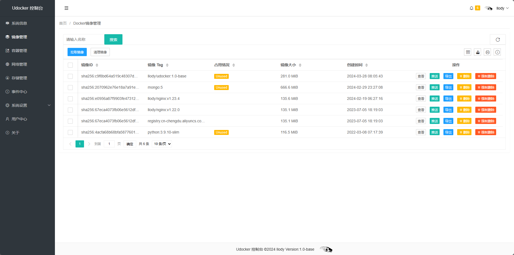
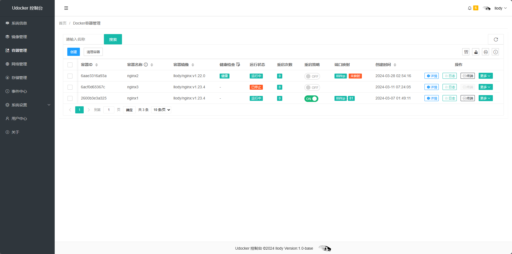
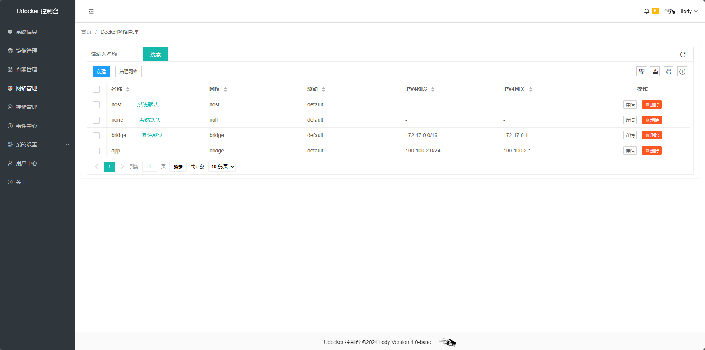
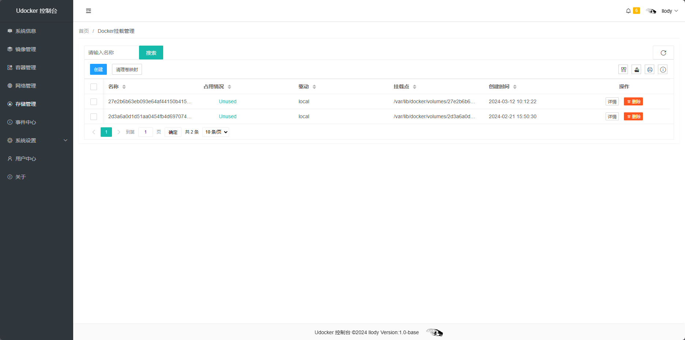
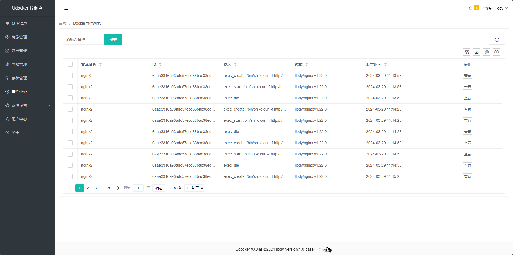
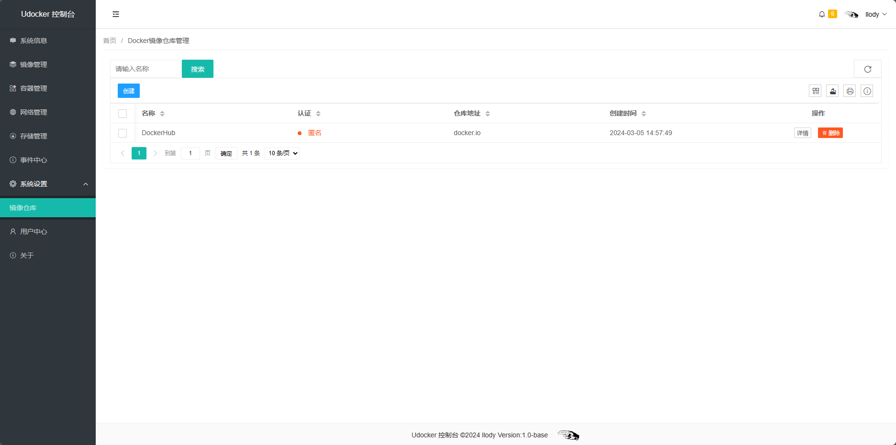
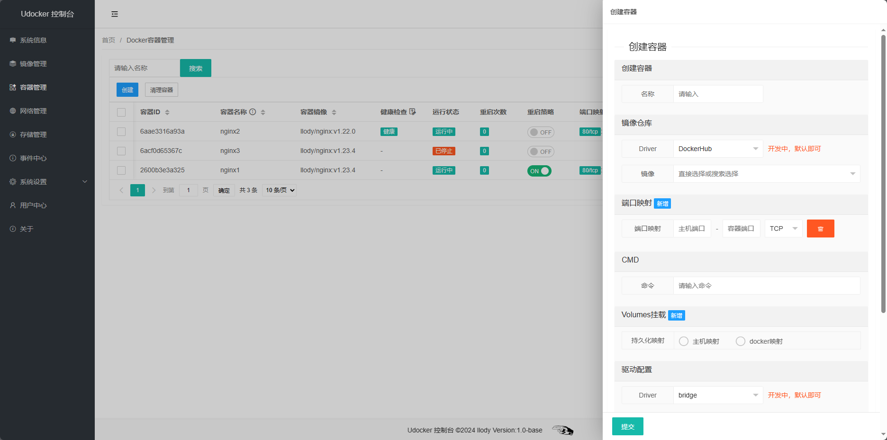
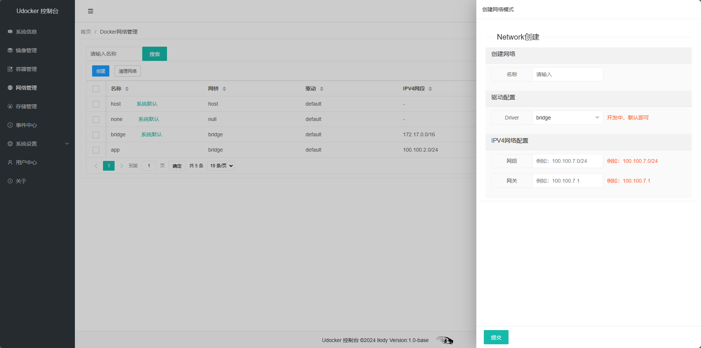
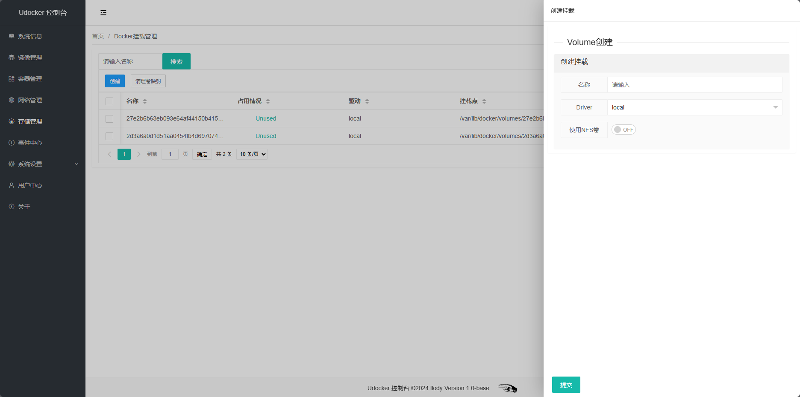

# udocker
<p align="center"><a href="#"></a></p>

**一个更简洁的Docker面板**

<div align="center">
<a href="https://github.com/llody55/udocker" target="_blank"></a>


</div>

> **声明:** 此项目当前为base版，请勿暴露于公网环境，可能引发安全问题
**如果此项目对你有用，请给一个**:star2:

## 资源
> 只需要：1核1G即可，暂时只有X86版本

## 安装与部署
```
docker run -itd --name udocker -p 8000:8000 -p 9002:9002 -v /var/run/docker.sock:/var/run/docker.sock  llody/udocker:v1.0-base
```
> 默认账户：llody 密码：1qaz2wsx
## 预览











## 致谢

## Star趋势
[](https://github.com/llody55/udocker)